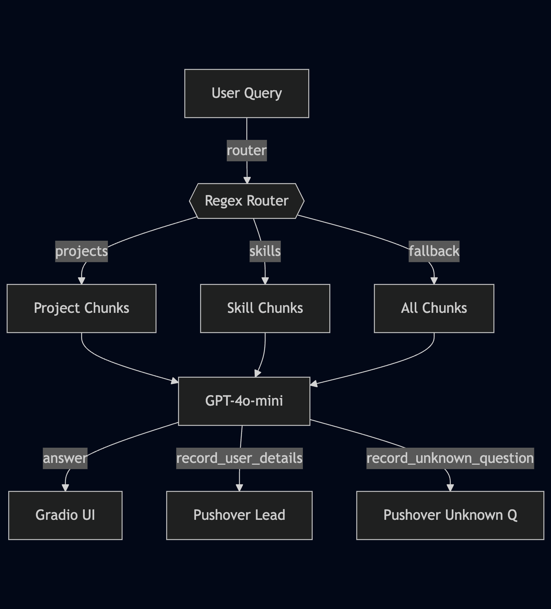

## 1&nbsp;· Motivation :thinking:

> I wanted something smarter than a static “About Me” page—  
> a way for visitors to **ask me anything** about my background, projects, or skills,  
> and for me to **know** when someone’s genuinely interested.

But I didn’t want to:

- hard-code a brittle FAQ  
- pay for a full vector database  
- miss potential leads while I’m offline

So I built a **lean, 150-line Python assistant** that:

- loads my résumé from a simple JSON file (no DB)  
- routes queries to the right section (`projects`, `skills`, etc.)  
- calls GPT-4o-mini using OpenAI function calling  
- alerts me via **Pushover** when someone submits a question it can’t answer, or shares their email

The result is a minimal, self-contained chatbot for my personal site that runs without a database and only needs an OpenAI key and a Pushover token to function.

---

## 2&nbsp;· Architecture :gear:

{width=650}

**Key decisions**

| Problem | Why not X | Solution |
|---------|-----------|----------|
| Retrieval for a 5 KB résumé | Vector DB overkill | Regex router + load JSON in-memory |
| Unknown questions | Manual inbox checking | `record_unknown_question` tool → push |
| Lead capture | Contact form spam | GPT asks for email + one-liner, then `record_user_details` |

---

## 3&nbsp;· Knowledge Base Structure :books:

```json title="data/chunks.json"
[
  { "id": "summary",
    "section": "summary",
    "text": "Bangalore-based CS undergrad focusing on applied ML…" },

  { "id": "exp_videoverse",
    "section": "experience",
    "text": "ML Engineer Intern — VideoVerse (Aug–Nov 2024)…" },

  { "id": "prj_fire_detection",
    "section": "project",
    "repo": "https://github.com/NeuralNoble/fire-detection",
    "text": "Drone fire-detection system using YOLOv8-Nano…" },

  { "id": "skills_core",
    "section": "skills",
    "text": "Python · PyTorch · TensorFlow · AWS · Docker…" }
]
```

!!! note
    Keep each chunk **≤ 350 tokens** so three of them + the prompt fit comfortably under GPT-4o-mini’s context window.

---

## 4&nbsp;· Core Logic :computer:

???+ example "Router & context builder"
    ```python linenums="1"
    INTENT_RE = {
        r"\b(project|github|built)\b": "project",
        r"\b(experience|job|intern)\b": "experience",
        r"\b(skill|tech|tool)\b": "skills",
        r"\b(educat|degree|study)\b": "education",
    }

    def route(query: str):
        for pattern, section in INTENT_RE.items():
            if re.search(pattern, query.lower()):
                return section
        return None  # fallback

    def build_context(query: str):
        section = route(query)
        parts = [c["text"] for c in CHUNKS if c["section"] == section] \
                if section else [c["text"] for c in CHUNKS]
        return "\n\n".join(parts)
    ```


```python title="Pushover helpers"
def push(msg):  ...
def record_user_details(email, name="n/a", notes=""): push(...)
def record_unknown_question(question): push(...)
```


```python title="LLM call"
messages = [
    {"role":"system", "content": persona},
    {"role":"system", "content": f"Context:\n{ctx}"},
    {"role":"user",   "content": user_msg}
]
response = openai.chat.completions.create(
    model="gpt-4o-mini",
    messages=messages,
    tools=TOOLS,
    max_tokens=256
)
```


---

## 5&nbsp;· Running Locally :rocket:

```bash
git clone https://github.com/NeuralNoble/portfolio-bot
cd portfolio-bot
python -m venv .venv && source .venv/bin/activate
pip install -r requirements.txt
# add OPENAI_API_KEY + Pushover keys to .env
python chat.py
```

Open <http://localhost:7860> and start a conversation.

---

## 6&nbsp;· Things I’d Improve Next :bulb:

* Swap regex routing for a **MiniLM** classifier to catch synonyms (“stack”, “tech”).  
* Add a **Whisper** endpoint for voice queries.  
* Cache answers in SQLite to cut token cost for repeated FAQs.

---

_Questions, suggestions, or want to fork it? Ping me on [LinkedIn](https://www.linkedin.com/in/aman-anand-10b51320b/) or open an issue on GitHub._


