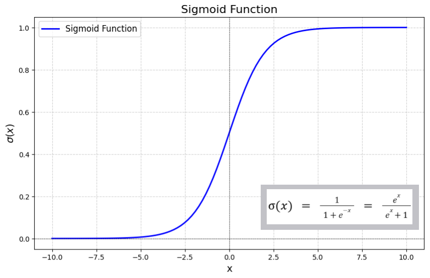
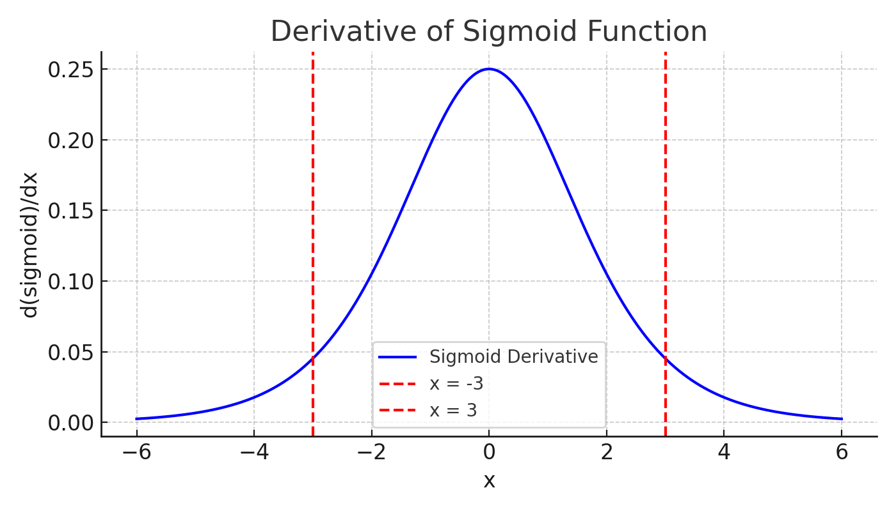

# **Activation Functions in Deep Learning** (in progress)

An intuitive journey into how they shape learning, bend gradients, and sometimes break them.

<!-- more -->

Activation functions are what make a neural network more than just a stack of linear equations. Without them, no matter how many layers you add, the network collapses into a single linear mapping.

!!! info " 🤔 Why do we need non-linearity in the first place?"
     If we keep stacking linear layers , as shown in the animation below , the network still acts like just one big linear layer. You can multiply all those weight matrices into one, and the output will still be a straight line.

    The problem is this. Sometimes the decision boundary that separates different classes is not a straight line. It might be curved, twisted, or broken into multiple pieces.
    
    A pure linear model cannot bend the input space to match that. No matter how deep you make it, it can only rotate, scale, or shift things around. It cannot fold the space to create meaningful separation.
    
    That’s where non-linearity comes in. Activation functions are what let the network bend, warp, and reshape the space between layers.
    
    They’re the reason neural networks can do more than just draw lines.


<video width="600" controls autoplay loop muted>
  <source src="../assets/LinearLayersAnimation.mp4" type="video/mp4">
  Your browser does not support the video tag.
</video>


Activation functions break that linearity. They bend the space. They allow a network to approximate weird, complex functions. But bending space is only half the story. What really matters is how that bending affects training. Because at the end of the day, all learning happens through gradients. Errors flowing backward. Tweaking the weights.
!!! info
    - So the real question is not just “Is this function non-linear?”
    - It is “How does this function treat gradients?”
    - If gradients die out or explode or behave unpredictably, training becomes hell.

## **Sigmoid / Logistic Activation Function**

The sigmoid function looks smooth, continuous, and well-behaved, which is exactly why it was so widely used in the early days. But that clean shape hides some nasty training issues.

**Definition:**

The sigmoid function is defined as:
```math
\sigma(z) = \frac{1}{1 + e^{-z}}
```


This function takes any real-valued input and maps it to a value between 0 and 1.

- For large positive inputs, the output gets very close to 1.
- For large negative inputs, the output approaches 0.

This property makes it useful in models where we want to predict probabilities. After all, probabilities naturally lie between 0 and 1.

### Derivative 
The sigmoid function is differentiable, which is a crucial requirement for backpropagation. Its derivative provides a smooth, non-jumping gradient.
```math
\frac{d\sigma(z)}{dz} = \sigma(z)\left(1 - \sigma(z)\right)
```
!!! abstract  "Sigmoid derivative derivation"
    ```math
    \text{Let } \sigma(z) = \frac{1}{1 + e^{-z}} = (1 + e^{-z})^{-1}
    ```
    ```math
    \text{Now, differentiate using the chain rule:}
    ```
    ```math
    \frac{d}{dz}(1 + e^{-z})^{-1}
    = -1 \cdot (1 + e^{-z})^{-2} \cdot \frac{d}{dz}(1 + e^{-z})
    ```
    ```math
    = -1 \cdot (1 + e^{-z})^{-2} \cdot (0 + e^{-z} \cdot (-1)) \\
    ```

    ```math
    = (1 + e^{-z})^{-2} \cdot e^{-z} \\
    ```

    ```math
    = \frac{e^{-z}}{(1 + e^{-z})^2}
    ```

    ```math
    \text{Now express this in terms of } \sigma(z):
    ```
    
    ```math
    = \left( \frac{e^{-z}}{1 + e^{-z}} \right) \cdot \left( \frac{1}{1 + e^{-z}} \right)
    ```
    ```math
    = \left(1 - \frac{1}{1 + e^{-z}} \right) \cdot \left( \frac{1}{1 + e^{-z}} \right)
    ```

    ```math
    = (1 - \sigma(z)) \cdot \sigma(z)
    ```
    ```math
    \text{Therefore:}
    ```
    ```math
    \frac{d\sigma(z)}{dz} = \sigma(z)(1 - \sigma(z))
    ```
Now, let's explore its two main problems.

### **Flaw #1: The Vanishing Gradient Problem**

Let's Look at the Graph of Derivative of Sigmoid:



If you see the graph . It forms a bell-shaped curve that is always positive and peaks at 0.25. And the gradient is only significant when the input lies approximately between -3 and +3.
Outside this range, the gradient becomes extremely small  close to zero. Which means if a neuron's input is strongly positive or strongly negative, the learning slows down drastically. This is called the vanishing gradient problem.

We can explain all this theoretically, but let’s be honest that’s not always intuitive. So let’s take a better approach.
We want to understand how the gradient becomes smaller and eventually vanishes when using sigmoid in a deep network.

To do that, we’ll walk through a simple example: a small feedforward network with a few layers, all using sigmoid activations. Then we’ll do backpropagation step by step to see exactly how the gradient starts shrinking layer by layer.
Once we do that, it will be clear why sigmoid struggles in deep networks.

!!! Example
    **Network Architecture:**

    ```math
    x \rightarrow \text{Layer 1} \rightarrow \text{Layer 2} \rightarrow \text{Layer 3} \rightarrow \hat{y} \rightarrow L
    ```
    **Input Layer:**  
    ```math
    a_0 = x(\text{input})
    ```
    **Layer 1:**  
    ```math
    z_1 = w_1 \cdot a_0 + b_1,\quad a_1 = \sigma(z_1)
    ```
    **Layer 2:**  
    ```math
    z_2 = w_2 \cdot a_1 + b_2,\quad a_2 = \sigma(z_2)
    ```
    **Layer 3:**  
    ```math
    z_3 = w_3 \cdot a_2 + b_3,\quad a_3 = \sigma(z_3) = \hat{y}
    ```
    **Loss:**  
    ```math
    L = \text{Some loss}(\hat{y}, y)
    ```

**Objective:**
We want to find 
```math
\frac{dL}{dz_1}
```
Gradient of the loss with respect to layer 1's input.

!!! info
    **We begin at the end of the network and apply the chain rule backward.**

#### Step 1: From loss to the last layer

```math
\frac{dL}{dz_3} = \frac{dL}{da_3} \cdot \frac{da_3}{dz_3}
```

- The loss depends directly on
```math 
 a_3 = \hat{y} 
```
```math
 a_3 = \sigma(z_3)
```
- so the derivative is:
```math
\frac{da_3}{dz_3} = \sigma'(z_3)
```

- Therefore:

```math
\frac{dL}{dz_3} = \frac{dL}{da_3} \cdot \sigma'(z_3)
```

#### Step 2: Backprop to layer 2
```math
\frac{dL}{dz_2} = \frac{dL}{dz_3} \cdot \frac{dz_3}{da_2} \cdot \frac{da_2}{dz_2}
```
```math
z_3 = w_3 \cdot a_2 + b_3 \Rightarrow \frac{dz_3}{da_2} = w_3 
```
```math
a_2 = \sigma(z_2) \Rightarrow \frac{da_2}{dz_2} = \sigma'(z_2)
```
Putting it all together:

```math
\frac{dL}{dz_2} = \frac{dL}{da_3} \cdot \sigma'(z_3) \cdot w_3 \cdot \sigma'(z_2)
```

#### Step 3: Backprop to layer 1

```math
\frac{dL}{dz_1} = \frac{dL}{dz_2} \cdot \frac{dz_2}{da_1} \cdot \frac{da_1}{dz_1}
```
```math
z_2 = w_2 \cdot a_1 + b_2 \Rightarrow \frac{dz_2}{da_1} = w_2
```
```math
a_1 = \sigma(z_1) \Rightarrow \frac{da_1}{dz_1} = \sigma'(z_1) 
```
Final expression:
```math
\frac{dL}{dz_1} = \frac{dL}{da_3} \cdot \sigma'(z_3) \cdot w_3 \cdot \sigma'(z_2) \cdot w_2 \cdot \sigma'(z_1)
```
Or:
```math
\frac{dL}{dz_1} = \frac{dL}{da_3} \cdot w_3 \cdot w_2 \cdot \sigma'(z_3) \cdot \sigma'(z_2) \cdot \sigma'(z_1)
```

Assume for simplicity:

- All weights are around 1
- Maximum derivative of sigmoid is 0.25

Then we get:

```math
\frac{dL}{dz_1} \le \frac{dL}{da_3} \cdot 1 \cdot 1 \cdot 0.25 \cdot 0.25 \cdot 0.25 = \frac{dL}{da_3} \cdot 0.015625
```

After just 3 layers, the gradient at the first layer has shrunk to **only about 1.5%** of what it was at the output.

#### Key Takeaways:

- Every time we move one layer backward, we multiply the gradient by a number **less than or equal to 0.25**
- Multiply many such numbers, and the gradient becomes **almost zero**
- This is the **vanishing gradient problem**

### **Flaw #2: The Output of Sigmoid is not symmetric around 0**

Before we understand this issue, I think we should ask ourselves:

!!! example "A Quick Refresher on Weight Updates"
    Let’s first recall how weights are updated during training:
    ```math
    w = w - \eta \cdot \frac{\partial L}{\partial w}
    ```
    Where:
    ```math
    \eta \text{ is the learning rate}
    ```
    ```math
    \frac{\partial L}{\partial w} \text{ is the gradient of the loss w.r.t the weight}
    ```
    Depending on the sign of the gradient:
    ```math
    \frac{\partial L}{\partial w} > 0 \Rightarrow \text{weight decreases}
    ```
    ```math
    \frac{\partial L}{\partial w} < 0 \Rightarrow \text{weight increases}
    ```
    This minus sign is what drives learning in the right direction.
    If we’re ahead of the minimum, the gradient is positive, so we move left.
    If we’re behind, the gradient is negative, so we move right.
    
    So you see why the gradient needs to be able to take both signs.
    But if you look at the graph of the sigmoid’s derivative  it's always positive for any value of x.
    Now remember this because that’s where the problem starts.

During backpropagation, the gradient with respect to a weight is computed as:

```math
\frac{\partial L}{\partial w} = \delta \cdot x
```
Where:  
```math 
  \delta
```
is the error signal for the neuron or the gradient of the loss with respect to the neuron's pre-activation 
𝑧 and x  is the input from the previous layer (which is the output of sigmoid)  
Since  x > 0  because  the derivative of sigmoid is also always positive, the sign of the gradient 
```math
\frac{\partial L}{\partial w} \text{ depends entirely on the sign of }  \delta .
```
That means for each neuron, **all weights connected to it are updated in the same direction** either all increase or all decrease. There's no flexibility, no independent control, no sign flipping and only one direction pulls.

Even though in reality, the weights should be pushed in different directions  sometimes up, sometimes down (in 2d)  the structure of the sigmoid prevents that flexibility. The result is biased updates and slower convergence.

Another way to put it: the direction of the update vector is always tilted. It's not adaptive. Instead of pointing straight toward the loss minimum, it keeps pulling diagonally. This slanted gradient makes optimization inefficient, especially in high-dimensional spaces.

Even in high-dimensional weight spaces, this problem doesn’t go away.

A model might be trying to reduce the loss by adjusting many weights simultaneously some increasing, some decreasing  depending on the slope of the loss surface in that region. But when using sigmoid activations, all inputs to a neuron are positive, and the gradient vector

```math
\nabla = \delta \cdot \begin{bmatrix} x_1 \\ x_2 \\ \vdots \\ x_n \end{bmatrix}
```
has only non-negative components. That means the update vector is restricted to only one quadrant of the space.

This breaks the optimizer’s ability to descend diagonally or adaptively. The update vector cannot point straight to the loss minimum and it’s always skewed. This causes inefficient learning, instability in the optimization path, and slower convergence, especially in deeper networks.

## **Tanh Activation Function**

