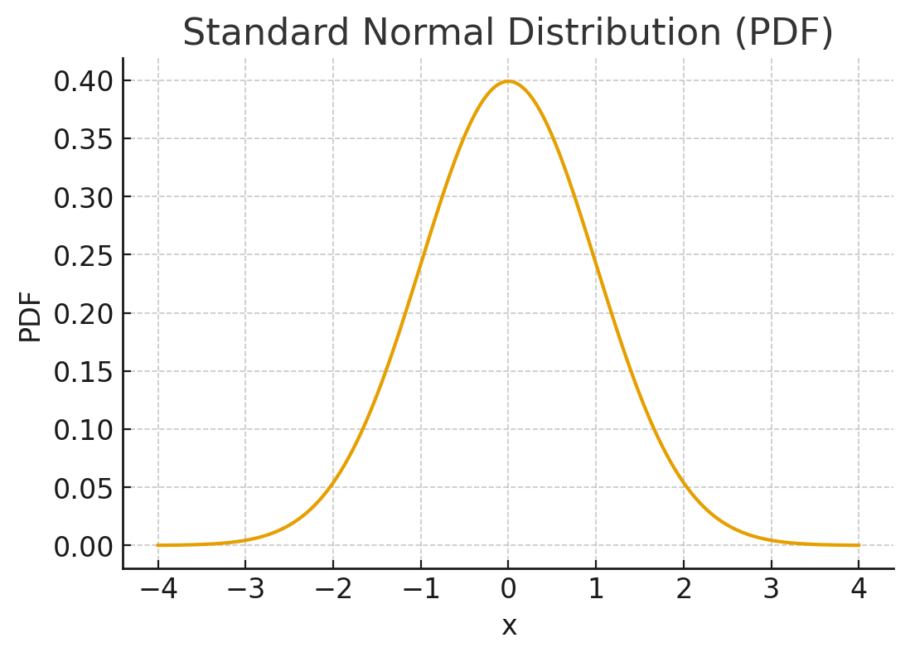
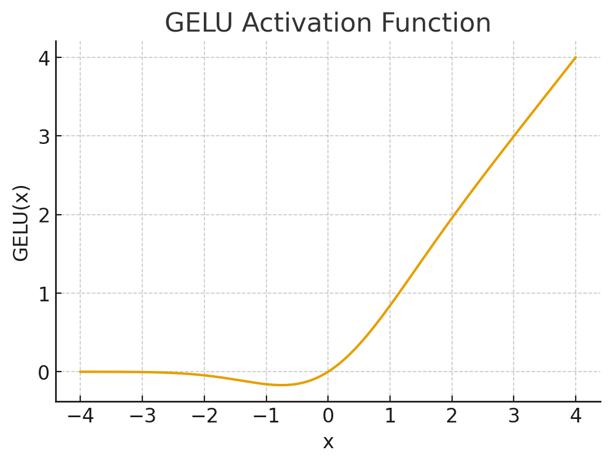
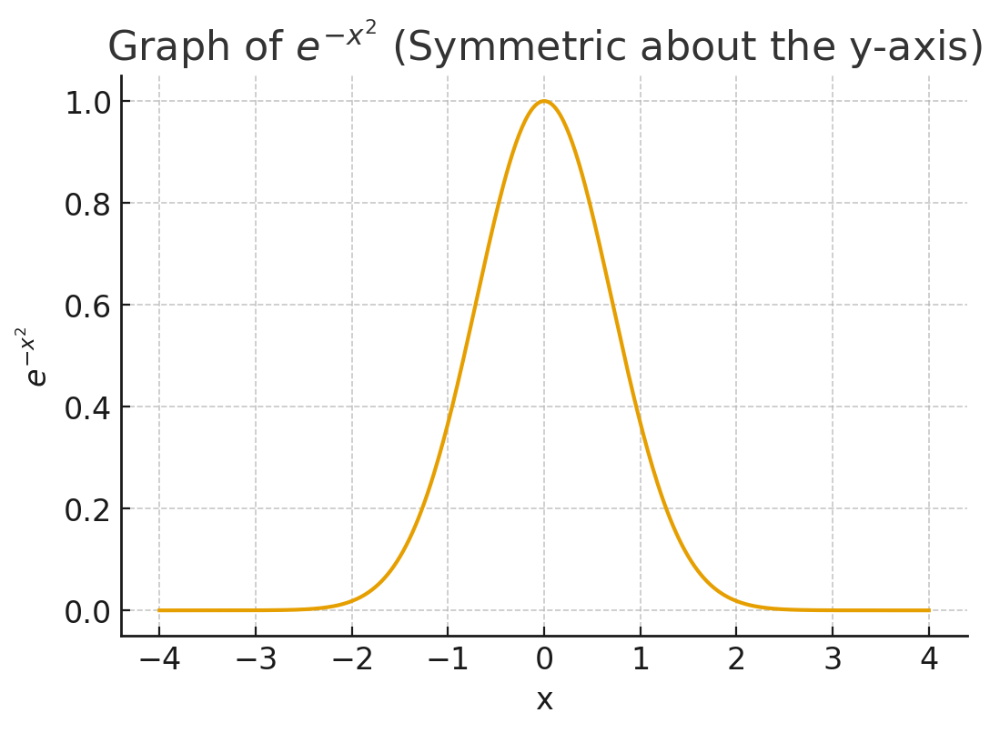
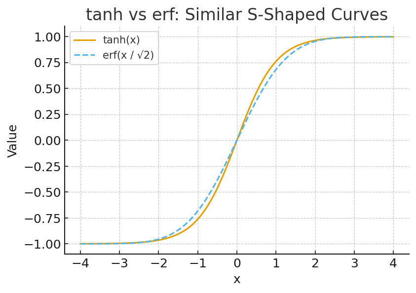

# **Gaussian Error Linear Units (GELUs)** 


The **GELU** is an activation function introduced in the paper **[Gaussian Error Linear Units](https://arxiv.org/abs/1606.08415)**. If you're unfamiliar with **activation functions** or want a refresher, you can check out **[this blog](https://neuralnoble.github.io/blog/activation-functions-in-deep-learning/)** where I explain them in detail.

<!-- more -->

GELU gained broad attention after Google adopted it in **BERT**, and later when OpenAI used it in **GPT-2**. Throughout the early Transformer era, models such as the GPT series, BERT variants, and Google’s Vision Transformer (ViT) relied heavily on GELU because its smooth, probabilistic formulation often led to better training stability and performance compared to ReLU.

However, while GELU was the dominant choice in those earlier architectures, **modern large language models have largely moved on** to more effective gated activations like **SwiGLU** (used in LLaMA and PaLM) and **SiLU/Swish**. <i>I will write blogs on them as well.</i>

## **Building the Foundations: Key Probability Concepts**

!!! info
    Before we dive into the details of GELU, let's cover some basic probability concepts. These will make the mathematical intuition behind GELU much clearer. We'll keep it simple and intuitive and don't worry no advanced stats required! If you are pro at stats you can just skip this section.

### **What is a Random Variable?**

When people hear “random variable” they often imagine something complicated but the idea is incredibly simple. A random variable is just a number we don’t know yet, but one that is generated by some process or an outcome generated by a random experiment.

!!! examples
    - Toss a coin once X = number of heads 0 or 1

    - Roll a dice X = number shown "1, 2, 3, 4, 5, 6"

    - Measure height of a random Indian adult X = height in cm"150.2, 171.5, 165.8, etc. (any real number in a range)"

 - If the outcomes are countable (like 1 to 6 on dice) → **Discrete Random Variable**
 - If the outcomes can be any real number in a range (like height, weight, temperature) → **Continuous Random Variable**

GELU uses a continuous random variable (the standard normal one) so keep that in mind.

### **Probability Distribution (A description of how likely different values are)**

A probability distribution is basically the full description of the behavior of a random variable.
It tells you:

- what values the random variable could take, and 
- how likely each of those values are.

For discrete variables (like dice rolls) this really is a literal list  value → probability.
But for continuous variables like height, time, temperature, neural activations  the story changes. You can’t just “list” infinitely many real numbers. Instead, we use a function to describe the likelihood landscape.

That function is the **PDF**.

### **Probability Density Function (PDF)**

When a random variable is continuous, you don’t assign probabilities to individual values, because that probability is always zero (there are infinitely many possibilities).

!!! question "Instead, you ask"
    What regions is the variable likely to fall into?

The PDF is the tool that answers this.
A PDF is a curve over the x-axis whose height at each x tells you how dense or concentrated the probability is around that value. It doesn’t give you the probability of that exact value because a single point has zero width and therefore zero area. But it tells you the intensity of probability around that area.

If the PDF is tall around x = 0 and flat near x = 5, it means the random variable strongly prefers values near 0 and rarely lands near 5.

The important part is this:

- To get actual probability, you look at area under the PDF.
- The area between two points, say 1 and 2, gives the probability that the random variable falls in that interval.

The total area under the whole PDF is 1.

### **Standard Gaussian Distribution (the most iconic PDF of all)**




Now that we know what a PDF is, the standard Gaussian (or standard normal) distribution becomes easy to understand. It is simply a PDF with a very specific shape: **the bell curve** (as you can see in the figure above).

It is centered at zero, symmetric around zero, and its “spread” is controlled by the variance. For the standard Gaussian, we fix:

- mean = 0 
- variance = 1

So the formula becomes:

```math
\phi(x)=\frac{1}{\sqrt{2\pi}} e^{-x^2/2}
```
Everything about this formula has a meaning:

- the exponential controls how fast the tails fall off,
- the constant out front makes sure the total area = 1,
- and the fact that it’s symmetric means values equally distant from 0 are equally likely.

This shape appears everywhere in nature and machine learning noise, weights , initializations, error behaviors because of deep mathematical laws like the **Central Limit Theorem**.

GELU uses this distribution because its activation idea is tied to the probability that a Gaussian random variable is less than a certain point.

To express that probability, we need something else: the cumulative view.

### **Cumulative Distribution Function (CDF) — probability accumulated up to x**
This is the point I wanted to reach when I started explaining the basics, because the CDF shows up directly in the GELU formula.

While the PDF tells us how dense the probability is at a point, the CDF tells us how much probability has been accumulated up to that point. Whatever area you’ve swept out is the probability that the random variable is less than or equal to x.

!!! tip "In simple words"
     For a given x the CDF answers "if i sampled a number from the PDF what's the chance it ends up <= x?"

And we can simply obtain CDF of a PDF by integrating it. Don't worry I will do full integration of PDF of Standard normal distribution below.

```math
PDF \xrightarrow{\text{integrates}} CDF
```
For standard normal  distribution

1. if `#!math x=0 \rightarrow CDF(0) = 0.5`. Because half the curve is left of zero
    
2. if `#!math x=2 \rightarrow CDF(2) \approx 0.977`. Because 97.7% of the bell curve is to the left of 2
    
3. if `#!math x=-2 \rightarrow CDF(-2) \approx 0.022`.

So we get the following intuition:

- Large positive x  CDF close to 1
- Large negative x CDF close to 0
- x around 0 CDF near 0.5

## **The GELU Formula: Bringing It All Together**

Now that we have the basics, let's introduce GELU. The GELU activation function for an input `#!math x` 
is defined as:

```math
GELU(x)=x⋅Φ(x)
```
Here, `#!math \Phi(x)` is exactly the CDF of the standard normal distribution we just discussed. In other words, GELU multiplies the input `#!math x`  by the probability that a standard normal random variable is less than or equal to `#!math x` .

This has a cool intuitive interpretation: For large positive `#!math x` , `#!math Φ(x)≈1`  so GELU passes `#!math x`  through almost unchanged (like the identity function). For large negative `#!math x` , `#!math Φ(x)≈0`, so GELU suppresses the signal (like ReLU). But unlike ReLU, it's smooth and allows a tiny bit of gradient flow for negatives, inspired by stochastic regularization techniques like dropout. 

The key is that transition from suppressing to passing is gradual and smooth(You can observe this in the graph below) because `#!math Φ(x)` is smooth. There is no hard cutoff like RELU's where everything (-)ve becomes exactly 0 and that smoothness gives nicer gradients for optimization.



As promised, let’s finally see how the CDF actually comes from integrating the PDF of the standard normal distribution. This is where things get interesting, because this integral behaves very differently from the simple integrals you’ve seen before in high school.
The integral of the Gaussian does not simplify into any combination of elementary functions. Instead, mathematicians define a special function the error function, written as erf specifically to represent this integral. Using this function, the Gaussian CDF can be written in a clean, exact form. Let's see the integration. 

!!! tip "Derivation of CDF by integrating PDF (for standard normal distribution)"
The PDF of the standard normal is:

```math
\phi(x)=\frac{1}{\sqrt{2\pi}} e^{-x^2/2}
```

To get the CDF, we need to integrate from −∞ to some value x:

```math
\Phi(x)=\int_{-\infty}^{x}\frac{1}{\sqrt{2\pi}} e^{-x^2/2} \, dx
```

let `#!math u = \frac{x}{\sqrt{2}}` 

so `#!math x = \sqrt{2}u ` and `#!math dx = \sqrt{2} du`

limits `#!math x = -\infty \rightarrow u = -\infty`

`#!math x = a \rightarrow u = \frac{a}{\sqrt{2}}`

Substitution

```math 
\Phi(a) = \int_{-\infty}^{a/\sqrt{2}} \frac{1}{\sqrt{\pi}} e^{-u^2} du
```


Split at 0 and use symmetry


```math
\Phi(a) = \underbrace{\int_{-\infty}^{0} \frac{1}{\sqrt{\pi}} e^{-u^2} du}_{\text{Part 1}} + \underbrace{\int_{0}^{a/\sqrt{2}} \frac{1}{\sqrt{\pi}} e^{-u^2} du}_{\text{Part 2}}
```

### **Evaluating the First Part**

```math 
\int_{-\infty}^{0} \frac{1}{\sqrt{\pi}} e^{-u^2} du
```

This evaluates to `#!math \frac{1}{2} `. Click on the drop-down button to see exactly how it evaluates to `#!math \frac{1}{2} `.

??? info "why this integral boils down to 1/2?"

    #### 1. The Strategy: Using Symmetry
    
    Instead of trying to solve this "improper integral" (from `#!math -\infty` to 0 ) directly, we can use a clever trick. The strategy relies on two key facts:

    1.  We know the value of the **full integral** from `#!math -\infty` to `#!math \infty`.
    2.  The function we are integrating, `#!math e^{-u^2}`, is an **"even function"** (meaning it's perfectly symmetric).
    
    Let's look at each part.

    #### 2. Fact 1: The Full Integral (The Gaussian Integral)
    
    First, let's look at the full integral over the entire number line:
    
    ```math 
    \int_{-\infty}^{\infty} \frac{1}{\sqrt{\pi}} e^{-u^2} du
    ```
    
    We can pull the constant `#!math \frac{1}{\sqrt{\pi}}` out:
    
    ```math 
    \frac{1}{\sqrt{\pi}} \int_{-\infty}^{\infty} e^{-u^2} du
    ```
    
    The integral `#!math \int_{-\infty}^{\infty} e^{-u^2} du` is one of the most famous and important integrals in all of mathematics, known as the **Gaussian integral**. Its value is proven to be exactly `#!math \sqrt{\pi}`.
    
    
    
    Therefore, when we substitute this value back in, we get:

    ```math 
    \frac{1}{\sqrt{\pi}} \times (\sqrt{\pi}) = 1
    ```
    
    So, we know for a fact that the **total area** under the curve of `#!math \frac{1}{\sqrt{\pi}} e^{-u^2}` from negative infinity to positive infinity is **1**.
    
    ---
    
    #### 3. Fact 2: The Even Function (The Symmetry)
    
    An **even function** is any function `#!math f(u) ` where `#!math f(u) = f(-u) `. Geometrically, this means the graph of the function is a mirror image of itself across the y-axis.
    
    Let's check our function, `#!math f(u) = e^{-u^2} `:
    
    * `#!math f(u) = e^{-u^2} `
      * `#!math f(-u) = e^{-(-u)^2} = e^{-u^2} `
    
    Since `#!math f(u) = f(-u) `, our function is **even**. The graph of `#!math e^{-u^2} ` is the classic "bell curve," which is perfectly symmetric.
    
    
    
    
    #### 4. Putting It All Together
    
    Now we can solve our original integral. We know two things:
    
    1.  The total integral (total area) is 1:
    ```math 
    \int_{-\infty}^{\infty} \frac{1}{\sqrt{\pi}} e^{-u^2} du = 1
    ```
    2.  The function is symmetric, so the area from `#!math -\infty` to 0 is **exactly equal** to the area from 0 to `#!math \infty `.
    
    We can split the total integral at 0:
    
    ```math 
    \int_{-\infty}^{\infty} ... = \int_{-\infty}^{0} \frac{1}{\sqrt{\pi}} e^{-u^2} du + \int_{0}^{\infty} \frac{1}{\sqrt{\pi}} e^{-u^2} du = 1
    ```
    
    Since the function is symmetric, the two integrals on the right side are equal. Let's call the value of our integral A:
    
    * `#!math A = \int_{-\infty}^{0} \frac{1}{\sqrt{\pi}} e^{-u^2} du`
      * And due to symmetry, `#!math \int_{0}^{\infty} \frac{1}{\sqrt{\pi}} e^{-u^2} du ` is also equal to A.
    
    Substituting A into our equation:
    
    $$A + A = 1$$
    $$2A = 1$$
    $$A = \frac{1}{2}$$
    
    And that's the solution. The integral `#!math \int_{-\infty}^{0} \frac{1}{\sqrt{\pi}} e^{-u^2} du ` is equal to $$\frac{1}{2}$$ because it represents exactly half the area of a symmetric function whose total area is 1.

### **Evaluating the Second Part**

```math 
\int_{0}^{a/\sqrt{2}} \frac{1}{\sqrt{\pi}} e^{-u^2} du
```
Now, if this were any normal-looking function, you’d expect a clean antiderivative involving polynomials, exponentials or trigonometric functions .

!!! abstract "Important"
    This integral has no closed-form solution using elementary functions.
    what i mean by it is that there is no combination of:

    - polynomials 
    - exponentials
    - logs
    - trig functions
    - inverse trig functions
    
    that gives you the antiderivative of `#!math e^{-x^2} `.
    This isn’t a failure of cleverness  it’s a proven result in mathematics.
    So what did mathematicians do?
    when an integral can't be represented using elementary fns, mathematicians define a new fn to represent it.
    So they invented a new special function just for this integral and that is erf.
    
    The erf function is formally defined as:
        
    ```math 
        erf(z) = \frac{2}{\sqrt{\pi}} \int_{0}^{z} e^{-t^2} dt
    ```

    - It’s not an approximation.
    - It’s not a hack.
    - It’s the exact way mathematics expresses this otherwise unsolvable integral.

Let's rearrange the erf definition to solve for the integral part, which is what we need:

```math 
\int_{0}^{z} e^{-t^2} dt = \frac{\sqrt{\pi}}{2} erf(z)
```

First, pull the constant `#!math \frac{1}{\sqrt{\pi}}` out of our second integral:

```math 
\frac{1}{\sqrt{\pi}} \int_{0}^{a/\sqrt{2}} e^{-u^2} du
```
Now, we can substitute the rearranged erf formula from step 2. We just need to set $$z = \frac{a}{\sqrt{2}}$$:

$$\frac{1}{\sqrt{\pi}} \left[ \frac{\sqrt{\pi}}{2} erf\left(\frac{a}{\sqrt{2}}\right) \right]$$


The `#!math \sqrt{\pi} ` on the outside cancels with the `#!math \sqrt{\pi} ` in the numerator:
$$\frac{1}{\cancel{\sqrt{\pi}}} \left[ \frac{\cancel{\sqrt{\pi}}}{2} erf\left(\frac{a}{\sqrt{2}}\right) \right] = \frac{1}{2} erf\left(\frac{a}{\sqrt{2}}\right)$$
And that's the result for the second integral.

Now, we just add them back together:

$$\Phi(a) = (\text{Part 1}) + (\text{Part 2})$$

$$\Phi(a) = \frac{1}{2} + \frac{1}{2} erf\left(\frac{a}{\sqrt{2}}\right)$$

Factoring out the `#!math \frac{1}{2} ` gives the final, clean expression :

$$\Phi(a) = \frac{1}{2} \left[ 1 + erf\left(\frac{a}{\sqrt{2}}\right) \right]$$

This formula is the **closed-form solution** for the Standard Normal Cumulative Distribution Function (CDF), `#!math \Phi(a) `, expressed using the error function, erf(z).

!!! tip "Important"
    So, when you substitute the derived formula into the GELU definition, you get the full equation:
    
    **$$GELU(x) = x \times \frac{1}{2} \left[ 1 + erf\left(\frac{x}{\sqrt{2}}\right) \right]$$**
    
    This is often written as:
    
    **$$GELU(x) = 0.5 \times x \times \left[ 1 + erf\left(\frac{x}{\sqrt{2}}\right) \right]$$**

## **Why erf Is Expensive (and Why Deep Learning Avoids It)?**

Here’s the catch: even though libraries like PyTorch expose a direct torch.erf function, computing `#!math erf(x)` numerically is expensive. The reason is simple evaluating the error function requires complicated numerical approximations: piecewise polynomials, rational approximations, and branching logic for different ranges of x.

Computing erf(x) is nothing like computing `#!math e^x` or `#!math tanh(x) `, which have fast, fused hardware instructions on modern GPUs. There is no native GPU instruction for erf. So PyTorch (and every other framework) must fall back to a software implementation, which internally uses:

- multiple polynomial approximations 
- multiple exponentials 
- conditional branches depending on x 
- table-based or rational approximations

GPUs hate branching and conditionals because they force entire warps of threads to wait while others execute different branches. So even though torch.erf works and is available, the GPU is still running a slow, divergence-heavy software routine underneath.

??? tip "Why GPUs Hate Branching (A Simple Intuition)?"
    ### **What is a GPU kernel?**

    A kernel is just a tiny function that runs on the GPU on thousands of threads at once.
    Every time you call a PyTorch operation (torch.add, torch.exp, torch.erf, etc.) PyTorch launches a kernel under the hood. if a function needs many operations(branches,loops,repeated instructions) that kernel becomes slow.
    
    But here’s the problem:

    ### **GPUs hate if/else branching.**
    
    To understand why, imagine a classroom with 32 students (a GPU warp).
    
    The teacher says:

    - “If your number is < 10, solve Problem A.”
    
    - “If your number is ≥ 10, solve Problem B.”
    
    Now half the students do A and half do B.
    The teacher can’t teach both at the same time, so:
    
    - she teaches group A while group B waits
    
    - then she teaches group B while group A waits
    
    So the class takes 2× longer.
    
    GPUs work exactly like this. A warp = 32 GPU threads executing together.
    If some threads take the “if A” branch and others take “if B” the GPU must run both paths serially.
    
    This slowdown is called **warp divergence** And functions like erf(x) trigger exactly this kind of branching internally:
    
    - different polynomial approximations for different x ranges
    - conditional logic
    - table-lookups vs rational approximations
    
    So a kernel that uses erf becomes slower. This is one of the reasons why the tanh-based GELU is so fast:
    
    - tanh = no branching
    - completely vectorized
    - runs perfectly on GPU hardware
    - zero divergence

??? tip "Now you might have a question which I also had when I first learned this: If evaluating erf numerically requires approximation, then isn’t erf itself an approximation?"

    This is a **great question**, and the confusion is very natural.
    The key is understanding the difference between:

    **1. A function’s exact *mathematical definition***

    vs

    **2. How a computer *evaluates* that function numerically**

    Think of erf like π (pi)
    This analogy will immediately clear the confusion.
    
    Mathematically:
    π is an *exact constant* defined as:
    
    > the ratio of a circle’s circumference to its diameter.
    
    This definition is **exact**, not approximate.
    
    Numerically:
    A computer can **only approximate π**:

    * 3.14
      * 3.14159
      * 3.14159265358979
      * etc.
    
    No matter how many digits you compute, your computer is giving an *approximation* of π.
    
    But that does **not** mean π “is an approximation.”
    It means **computers approximate π because they cannot represent it exactly.**
    
    erf is the same story

    **Mathematically:**
    
    `erf(x)` is defined *exactly* as:
    
    ```math 
    \operatorname{erf}(x) = \frac{2}{\sqrt{\pi}} \int_0^x e^{-t^2} , dt
    ```

    That integral **is the definition**.
    It is exact. No approximation.
    It is as mathematically precise as sin(x) or log(x).
    
    But computers cannot compute this integral analytically (there’s no closed form),
    so they approximate erf(x) using:
    
    * polynomial expansions
      * rational Chebyshev approximations
      * piecewise formulas
      * table lookups
      * Newton iterations
    
    So:
    
    ✔ **erf is exact in math**
    
    ✔ **evaluating erf on a computer uses approximations**
    
    ✔ **but that does NOT make the erf *function* an approximation**
    
    Exactly like π.


When you use GELU, this matters a lot. A transformer computes GELU billions of times during training. Using the exact erf-based GELU means paying this cost every single time, which substantially slows down training.

This is why modern deep learning frameworks avoid evaluating the exact erf version of GELU repeatedly, and instead rely on a fast approximation (like the tanh-based one) that behaves almost identically but runs dramatically faster on hardware.

Let's Look at them.

## **The Practical Fix: A Fast Tanh-Based Approximation of GELU**

Researchers noticed something elegant:

- the normal CDF `#!math Φ(x)`
- and the `tanh` function

have **very similar S-shaped curves**.



So instead of computing:

```math
GELU(x)=x⋅Φ(x)
```

we use a fast, smooth approximation of Φ(x) that runs extremely well on GPUs.

The tanh-based approximation is:

```math
GELU(x) \approx 0.5x \left(1 + \tanh\left[\sqrt{\frac{2}{\pi}} (x + 0.044715 x^3)\right]\right)
```

This formula may look random at first, but every constant inside it was chosen carefully by curve fitting so that:

- it matches the Gaussian CDF almost perfectly
- it is numerically stable
- it is dramatically faster than calling `erf`

And because GPUs have optimized vectorized implementations of `tanh`, this version is not just faster it’s **much faster** on every modern deep learning accelerator.

## **Wrapping Up**

We’ve now traced the entire story of GELU from the first principles of random variables and probability, all the way through the structure of the Gaussian distribution, the origin of the CDF, the appearance of the error function, and finally how all of that condenses into a single activation function used across deep learning.

What makes GELU beautiful is that it isn’t just another heuristic nonlinearity.
It’s a function with deep probabilistic meaning, smooth gradients, and practical engineering trade-offs that shaped the Transformer era. The exact version comes straight from the mathematics of the Gaussian, while the tanh approximation arises from clever numerical insight designed to make training fast on GPUs.

If you’ve followed everything up to here, you now understand not just what GELU is, but why it exists, how it’s derived, and why modern deep learning uses the approximate version in practice. And that means you understand it far more deeply than most people who just “use it because the paper said so.”

## **If You’d Like to Reach Out**

If you have any questions, doubts, or want to discuss anything from this blog, feel free to comment or reach out to me on my socials. And if you notice any mistake or think something could be improved, please let me know  I’m always learning and refining as I go.