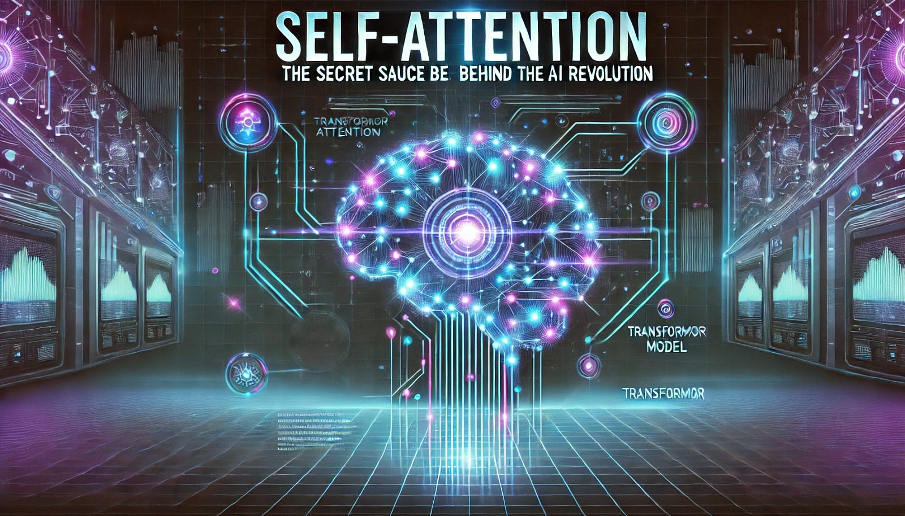

# Self-Attention: The Magic Behind Transformers and the AI Revolution

Today, we're diving into something that's at the core of Transformers, and Transformers themselves are at the core of this AI revolution! 
<!-- more -->
Meet self-attention - the secret sauce that lets models like GPT understand the relationships between words, no matter where they appear in a sentence. 
It's like giving AI superpowers to focus on the important stuff, making sense of everything from language translation to creative text generation.
