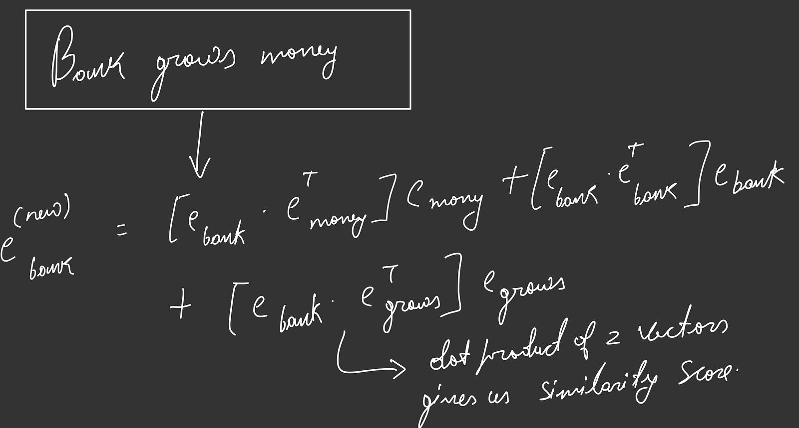

# **Self-Attention: The Magic Behind Transformers and the AI Revolution** (old, redundant writing new)

Today, we're diving into something that's at the core of Transformers, and Transformers themselves are at the core of this AI revolution! 

<!-- more -->

Meet **self-attention** - the secret sauce that lets models like GPT understand the relationships between words, no matter where they appear in a sentence.  
It's like giving AI superpowers to focus on the important stuff, making sense of everything from language translation to creative text generation.

If I asked you, *"What's the most important task in all of natural language processing (NLP)?"*, what would your answer be?  

Of course, it's converting words into numbers, right? After all, computers can't understand words like we do - they need everything in numeric form to perform any computations. But here's the catch: converting words to numbers in a meaningful way isn't as straightforward as it seems.

## The Problem with Traditional Word Representations  
Initially, the simplest way we represented words as numbers was through techniques like one-hot encoding. Each word was assigned a unique vector of 1s and 0s. While this approach works, it completely ignores relationships between words. For example, "dog" and "cat" would be as unrelated as "dog" and "table" in this representation, despite "dog" and "cat" being semantically closer.  
To address this, we developed word embeddings like Word2Vec, which represented each word as a vector in a continuous space, capturing semantic relationships like "king" being closer to "queen" than to "apple." But the problem with word embeddings was that it doesn't really capture the contextual dynamic meaning rather static average meaning like no matter if we are saying "river bank" or "money bank" bank would have the same vector.

## The Need for Context  
But here's the thing: words change meaning depending on the context. Think about the word "bank":

- "I went to the bank to deposit money."
- "We sat by the river bank."

In both sentences, the word "bank" is used, but its meaning is completely different. Traditional word embeddings can't capture this change in meaning. They assign one fixed vector to "bank," even though the word means different things in different contexts.

## How Self-Attention Works from First Principles  
To truly capture the context of words in a sentence, we needed a way to represent each word based on its relationship with every other word in the sentence. In simple terms, we needed to weigh how important other words are when interpreting a given word.

Instead of assigning a fixed meaning to each word (as we did with traditional embeddings), we began representing each word as a weighted sum of all the other words in the sentence. The key idea here is that we dynamically adjust these weights based on how relevant each word is to the word we're focusing on.

This idea of dynamically focusing on diff parts of sequence/sentence is why it is referred to as "attention".

In self-attention, we start with the old word embeddings, which are the initial vector representations of the words in the sentence. But we don't stop there. The goal of self-attention is to generate new, context-aware embeddings for each word by making each word a weighted combination of all the other words in the sequence.  
So, how do we calculate these weights?  
These weights represent how much each word should "pay attention" to every other word in the sentence, and they are based on similarity scores between the words. To calculate these similarity scores, we use the dot product.

Imagine we are trying to calculate a new embedding for a specific word (let's call it Word A). To do this, we compare Word A with all the other words in the sentence, including itself.

- For each comparison, we take the dot product of Word A's embedding (its query) with the embeddings of the other words (their keys). This gives us a similarity score - essentially a measure of how related Word A is to each of the other words.

!!! note "Note"
    These similarity scores tell us how much weight each word should have in influencing the final representation of Word A. If two words are very related (high dot product), the weight will be high, meaning that word will strongly influence Word A's final embedding. If they're less related (low dot product), the influence will be smaller.

Now let's take an example:

we have the sentence "bank grows money", and we want to generate a new embedding for the word "bank" using self-attention. Here's how the process unfolds:

**Old word embeddings**: We start with the original word embeddings for each word in the sentence:

    - bank: E_bank  
    - grows: E_grows  
    - money: E_money  

    These embeddings are just vectors representing each word, but they don't yet capture context.

**Calculating similarity (dot product):** To generate a new embedding for "bank," we calculate how similar "bank" is to itself, "grows," and "money."

   - Similarity between "bank" and "bank": We take the dot product of E_bank with itself. This will be a high score since it's comparing "bank" to itself.  
   - Similarity between "bank" and "grows": We take the dot product of E_bank with E_grows. This score will tell us how relevant "grows" is for understanding "bank."  
   - Similarity between "bank" and "money": We take the dot product of E_bank with E_money. This will tell us how much attention "bank" should pay to "money."

**Generating weights (softmax):** The dot products give us raw similarity scores for each pair. But to make these scores more interpretable, we pass them through the softmax function, which converts them into weights that sum to 1.  
   - Let's assume the following weights result:  
    
       Weight for bank itself: 0.6  
       Weight for grows: 0.2  
       Weight for money: 0.2  
       These weights tell us how much attention "bank" should give to each word.

**Weighted sum of the values:** Now that we have weights, we combine the original embeddings of each word to form the new embedding for "bank."

    - New embedding for "bank" = (0.6 * E_bank) + (0.2 * E_grows) + (0.2 * E_money)

This new embedding is context-aware: it doesn't just represent the word "bank" on its own; it now also incorporates the influence of "grows" and "money," based on how relevant those words are.
